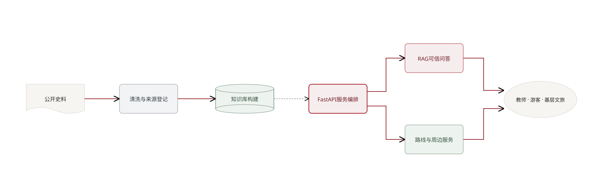
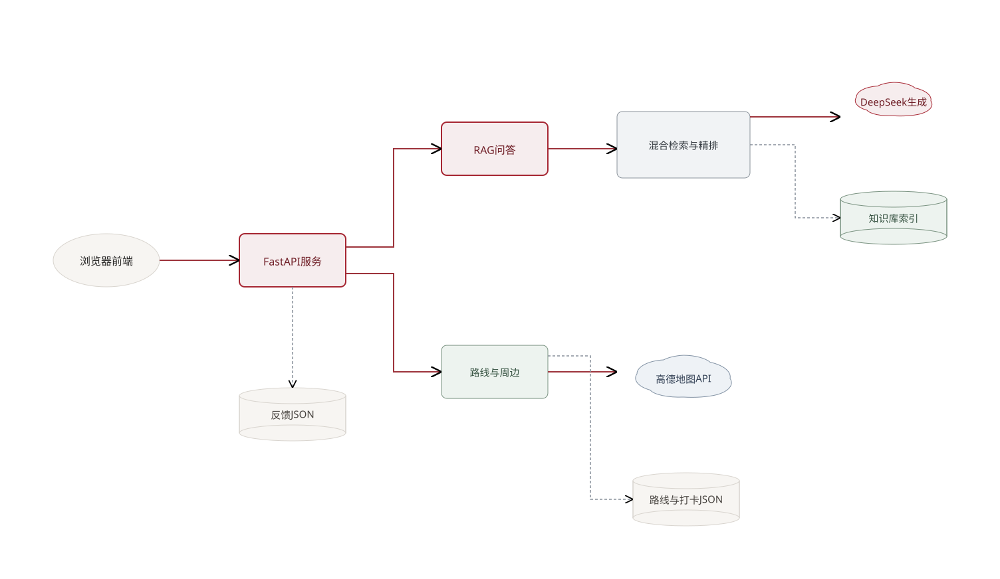
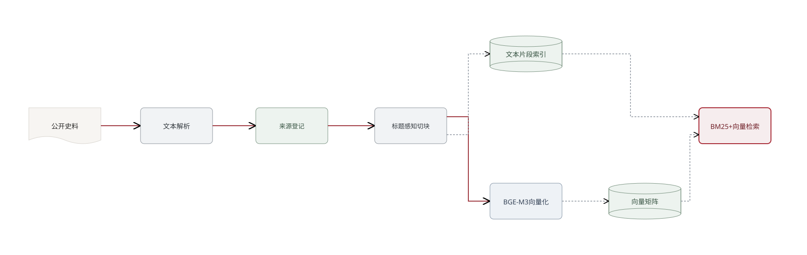
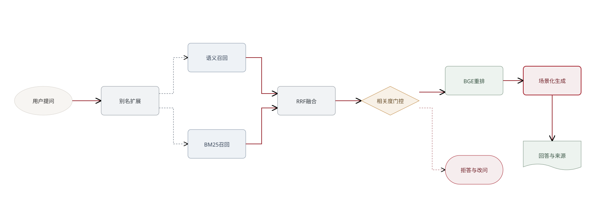
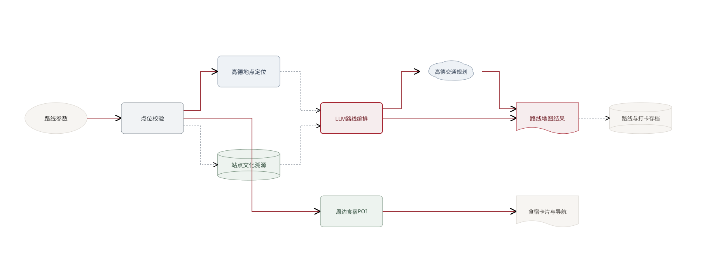
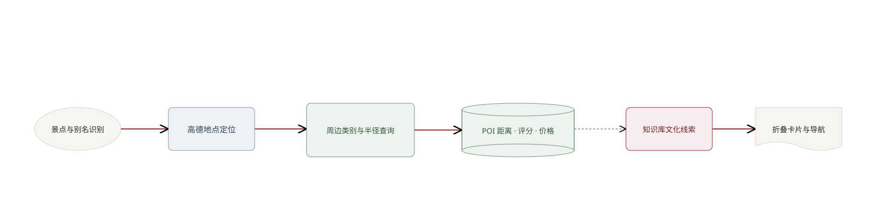
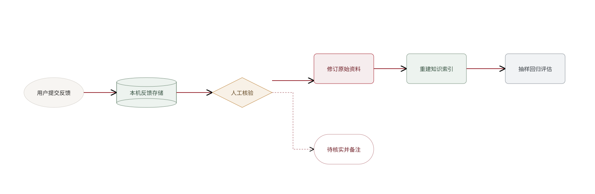
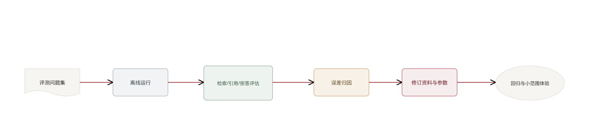

# 徽州问典技术路线与系统架构

> 用途：供项目技术说明、路演 PPT 和后续研发对照。本文以当前代码为准；“规划扩展”不代表现有原型已经具备。

## 一、技术路线总览

项目采用轻量 Web + 检索增强生成（RAG）方案：先将公开地方文史资料整理为带来源元数据的知识片段，再通过关键词与语义混合检索、相关度门控、重排序和带引用生成，为教师研学、游客讲解和基层宣传提供不同形式的内容。路线与周边服务调用地图 Web API；反馈进入人工核验流程。

## 二、正式分层架构图

### 分层说明

| 层级 | 当前实现 | 主要职责 |
|---|---|---|
| 用户呈现层 | `app/static/index.html` | 三种服务模式、问答、引用来源、路线地图、食宿卡片、反馈入口 |
| 应用服务层 | FastAPI `app/main.py` | HTTP 请求校验、调用核心服务、返回结构化结果；本机审核接口限制本机请求 |
| 领域编排层 | `core/pipeline.py`、`route_planner.py`、`recommender.py` | 串接 RAG、路线、POI 推荐和输出规则 |
| 检索与模型层 | `retriever.py`、`reranker.py`、`generator.py` | BM25+向量召回、RRF、拒答门控、重排、LLM 回答及引用编号 |
| 数据与索引层 | `data/raw`、`data/kb`、JSON 文件 | 原始资料、分块及元数据、向量矩阵、路线打卡和反馈记录 |
| 外部服务层 | DeepSeek、高德地图；WeKnora 可选 | 大模型生成、地图 POI/路线服务、可切换的检索后端 |

## 三、知识库构建流程

**实现定位：** 建库脚本目前支持 `.txt/.md/.html/.pdf`。PDF 走文本抽取；计划书提到的 macOS Vision 扫描件 OCR、音频转写、老照片归档和人物—地点—事件实体关联库，当前仓库未见相应处理管线或存储结构，应放在“后续技术路线”而非“已实现架构”。

## 四、可信问答流程

**代码对应：** 默认本地检索路径使用配置中的 Top-K、BM25/向量权重和拒答阈值；重排后将最多 5 条证据交给生成层。WeKnora 后端是可选配置，分数口径不同，拒答阈值需独立校准。来源编号是回答证据的可追溯入口，不等同于自动事实核验或“绝对无幻觉”。

## 五、路线与周边服务流程

### 5.1 研学路线

路线编排由 LLM 产生“主题顺序与研学任务建议”，地图定位和真实交通段由高德服务提供。高德定位失败、必经点不属于选定城市、地图 API 未配置时，服务返回错误，不应把模型生成的路线描述包装成已核实的运营信息。

### 5.2 景点周边餐饮与住宿

评分、价格和特色标签来自地图 POI 返回字段，可能为空或过期；文化溯源是对知识库命中结果的补充，不代表商家官方背书。若某 POI 没有可用字段，界面应显示“暂无数据”而不推测。

## 六、反馈与内容治理闭环

当前反馈文件存放在运行服务的本机项目目录，适合演示原型；不是多用户生产级审核平台。正式部署前需要持久数据库、身份认证、权限、审计日志、备份与数据保留策略。

## 七、质量评估与迭代路线

建议将评估拆成检索质量、回答忠实度、引用可核查性、拒答准确性、路线可执行性和用户可读性六类。计划书记录的 MRR 提升数值应附带评测集规模、基线定义和实验日期；若这些信息不齐，不建议单独将数值作为性能结论展示。

## 八、当前能力与规划边界

| 能力 | 当前仓库可确认状态 | 路演表述建议 |
|---|---|---|
| Web 三模式问答 | 已实现教师、游客、宣传模式参数与提示词 | “原型支持三类场景化输出” |
| RAG 检索溯源 | 已有本地混合检索、重排、阈值拒答、来源编号 | “降低无依据生成风险，回答附可核对来源” |
| PDF 扫描 OCR | 当前 PDF 仅文本抽取；未见 Vision OCR 管线 | 作为后续建设，或先将 OCR 文本人工整理入库 |
| 人物—地点—事件实体库 | 配置里有别名词表；未见独立实体图数据库/实体校验流程 | 当前称“领域别名扩展”；图谱/实体校验属规划 |
| 音频转写/照片归档 | 当前建库脚本无音频和图像解析 | 规划多模态史料入库，不宣称已实现 |
| 研学路线与地图 | 已接高德定位/路径规划，LLM编排站点任务 | “地图 API 计算交通段，模型生成主题与任务建议” |
| 食宿 POI 推荐 | 已接高德周边搜索并返回字段与导航链接 | 明确数据来自地图服务，评分/价格以接口可用数据为准 |
| 反馈审核 | 本机 JSON 保存及本地接口审核 | “原型内反馈收集与人工查看”，不称生产审核平台 |
| 规模化部署/多租户 | 当前无生产级账号、权限和数据库架构 | 作为部署阶段规划 |

## 九、建议的 PPT 技术路线页拆分

1. **总技术路线**：资料汇聚 → 知识库构建 → 可信问答 → 研学/文旅应用 → 人工反馈迭代。
2. **系统分层架构**：前端、FastAPI、领域服务、RAG/模型、数据存储、外部 API 六层。
3. **可信问答流程**：混合召回、RRF、拒答门控、重排、引用生成、来源展示。
4. **知识库数据工程**：原始文档、元数据、标题切块、向量化、持久化；OCR/多模态明确标为下一阶段规划。
5. **路线与周边流程**：LLM 负责主题与任务，高德负责 POI 定位和交通段，知识库负责文化背景。
6. **内容治理与迭代**：反馈 → 人工核验 → 改资料 → 重建索引 → 离线评测。

建议视觉图例：深红实线表示主要业务流，灰色虚线表示数据读写或辅助关系，浅红虚线表示待核实分支；暖白、灰蓝、淡绿区分用户、服务与数据节点。每张图保留 5–8 个主节点，细节另以讲解页展开。

## 十、开源方案借鉴与采用边界

| 开源项目/方法 | 可借鉴能力 | 本项目采用方式 | 边界与成本 |
|---|---|---|---|
| BEIR（Apache-2.0） | 以 query、corpus、qrels 组织检索评测；比较 Recall、nDCG、MRR 等排序指标 | 离线评测脚本沿用其标准 IR 指标与可复现对比思路，不引入整套 BEIR 数据/运行依赖；本地语料规模较小，使用项目自有问题集 | 当前 qrels 由期望关键词匹配知识片段自动近似，仍需人工标注相关片段后才能作为严格效果结论 |
| Ragas | 评估 context precision/recall、faithfulness、response relevancy、answer accuracy 等问答质量 | 作为下一阶段回答质量评测候选；当前先完成可离线复跑的检索评测，之后为已标注问答样本增加 judge 评测 | 多项指标会调用 LLM；需固定评审模型、提示词与成本预算，并抽样人工复核，避免把模型打分当成真值 |
| FlagEmbedding / BGE | 官方 BGE 模型、向量检索与 cross-encoder 重排实践 | 项目已使用 BGE-M3 与 BGE reranker；本轮基准单独比较重排前后，暂不重复引入 FlagEmbedding 作为另一层框架 | 转换模型调用实现前，需在同一机器、同一候选集上比较速度、内存和排序质量 |

### 本轮评测新增

`scripts/run_retrieval_benchmark.py` 在 50 个既有问答之外加入 15 个手工别名挑战题，并为意图生成语境前缀、口语问法及语义改写。报告区分不同检索方案，增加 nDCG@10 与 Recall@10，并记录交叉编码器的逐题胜/平/负。该实现借鉴 BEIR 的 qrels 排名评测范式，但由于相关片段目前通过期望词自动匹配，结果应标为“检索代理评测”，不可表述为答案准确率或全面优于其他产品。

Ragas 不在本轮默认安装：它适合后续评估生成答案是否忠实于引用证据，但需要评审模型调用和明确的成本、版本控制。任何“比其他产品更好”的结论都应先定义相同题集、相同上下文和评分标准，并保留失败样例；当前本地基准只比较本项目内部的检索配置。
